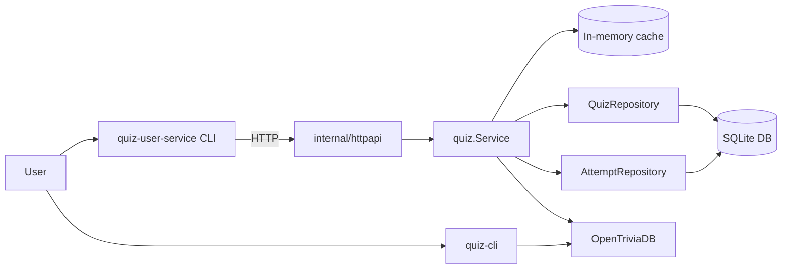
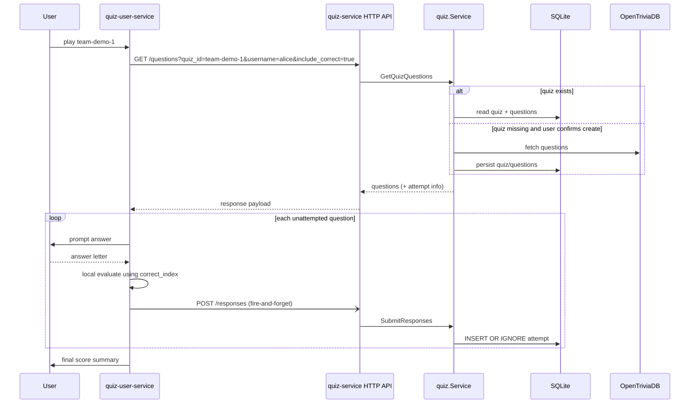
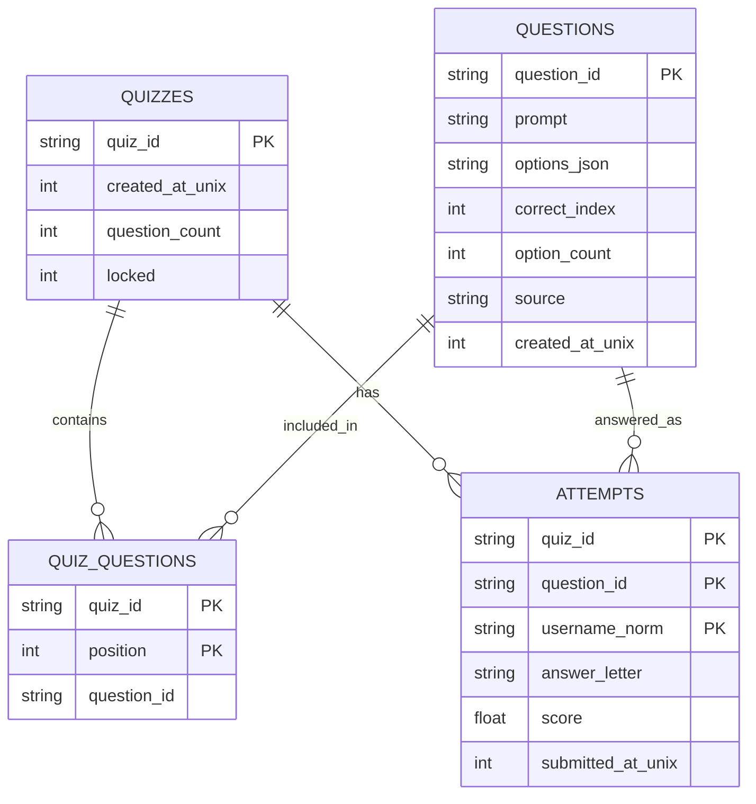

# Diagrams

## 1. Component Diagram



## 2. Sequence: `play <quiz_id>` Flow



## 3. Data Model (SQLite)



Additional schema constraint on `quiz_questions`: `UNIQUE (quiz_id, question_id)`.

`position` was introduced for a planned `next_question` flow. That flow is currently not in the API, so strict ordering is not required in the current implementation, but this column keeps the model ready for hosted one-question-at-a-time quiz release.

## 4. Leaderboard Ordering Rule

```text
Sort order:
1) total_score DESC
2) last_submission_at ASC
3) username ASC
```
